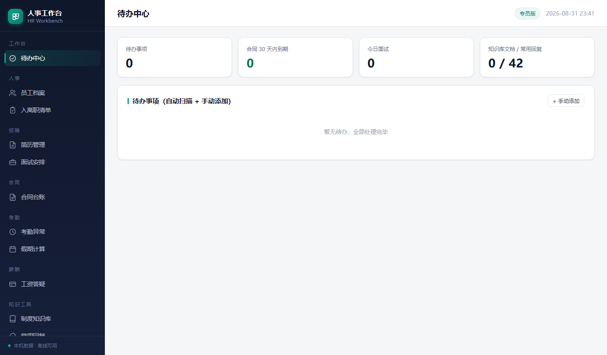
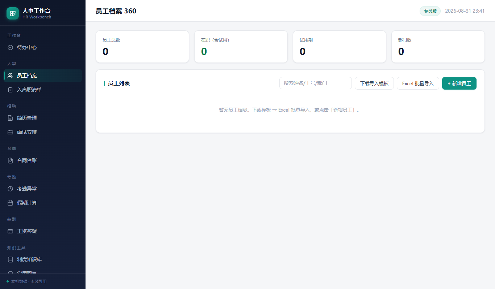
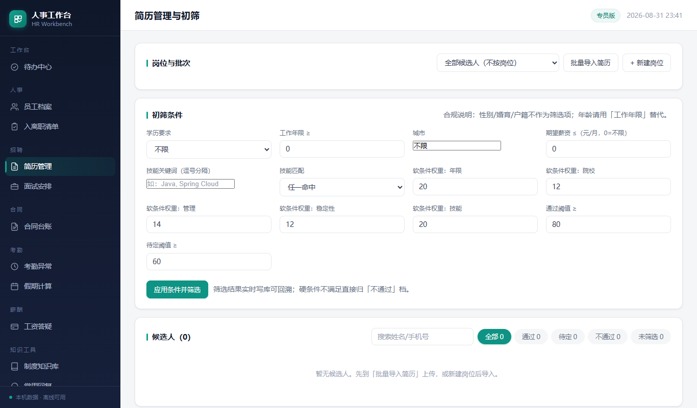

# 人事工作台 (HR Workbench)

> 绿色免安装单机版人事工作台 —— 拷贝整个目录即用，删除目录即卸载，敏感数据不出本机。

把人事专员日常 80% 的高频操作装进一个双击即跑的小工具：

- 员工档案、合同台账、简历初筛、考勤异常批处理、假期计算、工资答疑
- 面试安排、入离职清单、常用回复（42 条话术）、文书生成（10 个模板）
- 制度知识库（条款级检索带出处）、待办中心（合同/试用期/异动聚合提醒）

无云依赖、无外部数据库、无需联网。`data/` 目录可整盘拷走做备份或迁移。

---

## ✨ 特性

| 模块 | 关键能力 |
| --- | --- |
| **待办中心** | 合同到期 / 第二次合同预警 / 试用期 / 入离职清单全部聚合，一键完成 |
| **员工档案** | Excel 导入 + 手动维护 + 异动时间轴，**身份证/银行卡默认掩码** |
| **简历管理** | 批量导入 → 规则引擎三档初筛（无需大模型） |
| **合同台账** | Excel 批量导入 + 60/30/7 + 第 2 次合同 90 天特别预警（劳动法第 14 条） |
| **考勤异常** | Excel 导入 → 分组 → 批量处理 + 月度汇总 |
| **假期计算** | 司龄 → 年假/婚假/产假额度自动算（带薪年休假条例参考） |
| **工资答疑** | 工资表导入 + 按人按月查明细 + 6 类常见差异原因话术 |
| **面试安排** | 面试 CRUD + 状态机 + 提醒 |
| **入离职清单** | 内置入职 13 项 / 离职 10 项模板，逐项勾选带进度条 |
| **常用回复** | 42 条话术 + `/nj` 快捷编号 + 一键复制（最高频功能） |
| **文书生成** | 10 个模板（JD / offer / 转正 / 调薪 / 证明等）+ 变量填充 + 员工带入 |
| **制度知识库** | 上传 txt/md/docx/pdf → 按「第 X 条」切片 → 关键词检索带出处 |

更多细节见 [使用说明.md](使用说明.md)（开发者版）和 [docs/人事工作台-UI重构说明-v3.md](docs/人事工作台-UI重构说明-v3.md)。

---

## 🚀 快速开始

### 方式一：双击启动（推荐）

```bat
启动工作台.bat
```

等待 2~5 秒，浏览器自动打开 `http://127.0.0.1:5270`。关闭黑色命令窗口即退出。

### 方式二：命令行启动

```bash
python -m venv .venv
.venv\Scripts\activate
pip install -r build/requirements.txt
python -m uvicorn app.main:app --host 127.0.0.1 --port 5270
```

> **首次启动**：自动建库（`data/hr.db`）+ 预置 42 条常用回复 + 10 个文书模板。
>
> **端口占用**：5270 被占时自动 +1（窗口会显示实际地址）。
>
> **局域网暴露**：必须在 `配置.yaml` 设置 `server.access_password`，否则启动被拒绝（防止身份证/薪资等敏感数据裸奔）。

---

## 🖼️ 界面预览

| 待办中心 | 员工档案 |
| --- | --- |
|  |  |

| 简历管理 | 登录页 |
| --- | --- |
|  |  |

更多截图见 [docs/ui_shots/](docs/ui_shots/)。

---

## 🧱 技术栈

- **后端**：Python 3.11+ · FastAPI · SQLAlchemy 2 · SQLite (WAL 模式) · APScheduler
- **前端**：Jinja2 服务端模板 · htmx 1.x · Alpine.js 3 · 原生 CSS（CSS 变量主题）
- **打包**：绿色化（内嵌 CPython 运行时，零安装；详见 `build/`）
- **解析**：openpyxl（xlsx）· python-docx（docx）· pdfplumber/PyMuPDF（pdf）· jieba（中文分词，可选）
- **存储**：单文件 SQLite + 全文检索（`trigram` tokenizer）

无 Docker / 无 Redis / 无外部依赖。完整依赖见 [build/requirements.txt](build/requirements.txt)。

---

## 📁 目录结构

```
人事工作台/
├── 启动工作台.bat           # 一键启动入口（GBK 编码，中文 Windows）
├── 配置.yaml                # 端口 / 数据库 / 提醒阈值 / 全文检索
├── 使用说明.md              # 开发者/维护者技术版说明
├── 使用说明-专员版.html     # 专员版友好单文件说明（330KB 图片内联）
├── LICENSE
├── app/                     # FastAPI 后端
│   ├── main.py              # 应用装配 + 中间件 + 启动扫描 + 备份
│   ├── boot.py              # 一键启动脚本（端口探测 + 浏览器自启）
│   ├── config.py            # 配置加载
│   ├── database.py          # SQLAlchemy 引擎 + 建表
│   ├── models.py            # ORM 模型
│   ├── seed_data.py         # 种子数据（回复/文书模板）
│   ├── routers/             # 页面 + JSON API
│   │   ├── pages.py
│   │   └── api.py
│   ├── services/            # 提醒同步 / 简历筛选
│   └── abilities/           # 简历解析 / 文档工具 / 调度器
├── web/                     # 前端
│   ├── templates/           # Jinja2 模板（22 页）
│   └── static/              # CSS / JS / vendor
├── build/                   # 打包 + 烟囱测试 + 截图脚本
│   ├── download_runtime.py  # 下载内嵌 CPython 运行时
│   ├── build.bat            # 绿色化打包
│   ├── inline_help_images.py# 说明 HTML 图片内联
│   ├── ui_shots.js          # Playwright 截图脚本
│   ├── smoke_*.py           # 各模块冒烟测试
│   └── requirements.txt
├── docs/                    # 用户文档与截图
│   ├── ui_shots/            # 界面截图
│   ├── 人事工作台-UI重构说明-v3.md
│   └── 回测报告-2026-08-31.md
├── data/                    # 运行时数据（.gitignore 排除）
│   ├── hr.db                # SQLite 业务库
│   ├── backups/             # 每日自动备份（保留 7 份）
│   ├── resumes/             # 简历样本
│   └── logs/                # uvicorn 日志
├── runtime/                 # 内嵌 CPython 运行时（.gitignore 排除，build 拉取）
└── .workbuddy/              # 私人工作记忆（.gitignore 排除）
```

---

## 🔒 安全与隐私

- **本地优先**：所有数据存于本机 `data/` 目录，不上传任何外部服务。
- **敏感字段掩码**：身份证、银行卡默认显示为 `110***********0023`。
- **局域网暴露需口令**：`server.access_password` 为空时，启动器**拒绝绑定非回环地址**。
- **每日自动备份**：首次启动时按 `YYYYMMDD` 打一份 `hr.db` 副本，保留最近 7 份。
- **WAL + checkpoint**：备份前自动 `PRAGMA wal_checkpoint(TRUNCATE)`，避免热备丢数据。

详见 [使用说明.md 第 16 节「数据放哪、会不会丢」](使用说明.md) 与 `app/main.py` 的 `do_backup_if_needed()`。

---

## 🧪 验证

- 接口回测：[docs/回测报告-2026-08-31.md](docs/回测报告-2026-08-31.md)（覆盖 12 个模块、关键接口、边界用例）
- UI 规范：[docs/人事工作台-UI重构说明-v3.md](docs/人事工作台-UI重构说明-v3.md)（设计 token / 布局 / 组件规范）
- 冒烟测试：`build/smoke_*.py`

---

## 🛠️ 路线图（v1.1+）

- 制度知识库接入大模型问答（已预留 schema，关键词模式可独立运行）
- 入离职清单的邮件/钉钉通知钩子
- 简历解析接入多模态模型（截图/扫描件）
- WebAuthn 登录（替代当前明文 cookie）

---

## 📄 License

[MIT](LICENSE) © 2026 hank209
